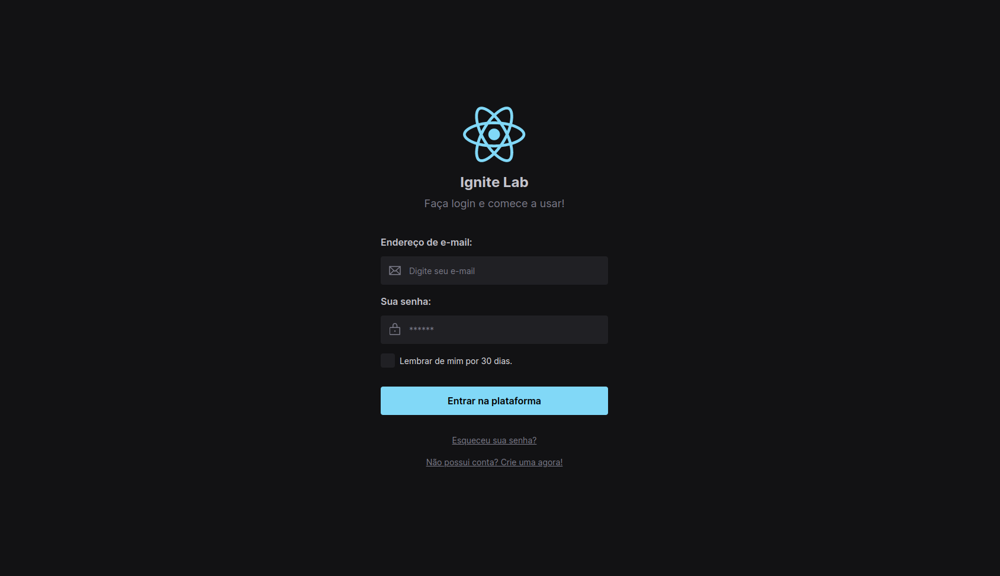

<h1 align="center">Design System - Ignite-Lab</h1>

  

 
 

<h2>🔖 See the results</h2>

You can view the figma layout through the link below:

<li><a target="_blank" href="https://www.figma.com/file/bqcnzsVsHcnDQlpdrCNj3h/Ignite-Lab-Design-System?node-id=0%3A1">Figma Layout</a></li>

You can view the project through the link below:

<li><a target="_blank" href="https://ignitelab-designsystem.netlify.app/">Live Preview</a></li>

You can view the storybook component docs through the link below:

<li><a target="_blank" href="https://marianapcorrea.github.io/Design-System-Ignite-Lab/">Storybook components docs</a></li>

 
 

<h2> 🧪 Technologies </h2>

This project was developed using:

<ul>
<li><a target="_blank"  href="https://reactjs.org/">ReactJS</a></li>
<li><a target="_blank"  href="https://tailwindcss.com">TailwindCSS</a></li>
<li><a target="_blank"  href="https://figma.com">Figma</a></li>
<li><a target="_blank"  href="https://storybook.js.org">Storybook</a></li>
<li><a target="_blank"  href="https://vitejs.dev">Vite</a></li>
<li><a target="_blank"  href="https://www.radix-ui.com">RadixUI</a></li>
</ul>

 
 

<h2>🚀 Getting started</h2>

Clone the project and access the folder.

<pre><code>git clone https://github.com/NitoBa/ignite-ds
cd ignite-ds
</code></pre>

Run this command to install the dependencies

<pre><code>npm install</code></pre>

Run this command to view the interface locally

<pre><code>npm run dev</code></pre>

Run this command to to view the storybook docs

<pre><code>npm run storybook</code></pre>

 
 

<h2>📝 License</h2>
This project is licensed under the MIT License. See the [LICENSE](LICENSE) file for details.

